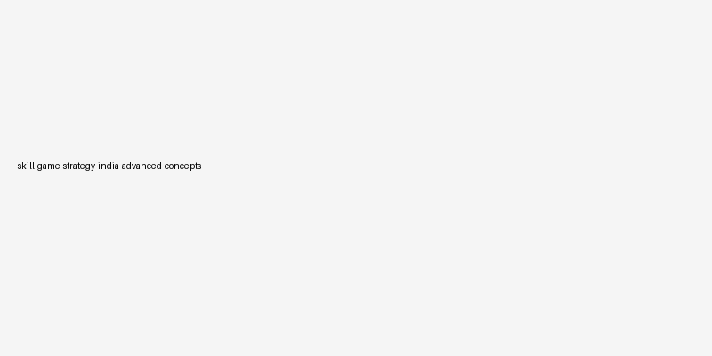

# Advanced Strategy Concepts in Skill-Based Gaming

## 🪶 Introduction

Once you have mastered the fundamentals of skill-based strategy, advancing to the next level requires understanding deeper concepts that separate competent players from exceptional ones. These advanced concepts include meta-strategic analysis, competitive edge development, and systematic game theory application. They build upon the foundation of basic skills and require both analytical thinking and extensive practical experience.

This guide explores advanced strategic concepts that apply across skill-based games, providing the intellectual frameworks needed to analyze complex competitive situations, anticipate opponent evolution, and develop strategies that remain effective against skilled competition.

---

## 🖼️ Advanced Strategy Concepts Overview

---

## 🎯 What Are Advanced Strategy Concepts?

Advanced strategy concepts represent the intersection of competitive theory and practical gameplay, incorporating principles from game theory, behavioral analysis, and systems thinking. These concepts help players understand not just what actions to take but why certain strategic approaches succeed or fail across different competitive contexts.

In skill-based gaming, advanced concepts manifest as the ability to read meta-level patterns, anticipate shifts in popular strategies, and position yourself ahead of these trends. Players who grasp advanced concepts can adapt their play not just to individual opponents but to the broader competitive landscape.

---

# 🧠 1. Game Theory Applications

Game theory provides mathematical frameworks for analyzing strategic interactions between rational decision-makers. While skill games were developed independently of formal game theory, many of its principles apply naturally to these competitive environments.

The concept of Nash equilibrium—where no player can improve their outcome by unilaterally changing strategy—appears in skill games when opponents reach a strategic balance. Recognizing when a match has reached equilibrium helps you understand whether deviation from current strategy might yield advantages.

Zero-sum and non-zero-sum dynamics also shape skill game strategy. In purely competitive games, one player's gain equals another's loss, creating direct opposition that demands aggressive optimization.

---

# 🧠 2. Meta-Strategy and Competitive Evolution

Meta-strategy refers to the strategy about strategy—understanding which approaches are currently dominant in the competitive environment and positioning yourself accordingly. The meta evolves as players discover new techniques, share knowledge, and adapt to each other's innovations.

In any active gaming community, you will observe cycles where certain strategies become popular, prompting counterstrategies to emerge, which in turn generate new dominant approaches. Understanding these cycles allows you to anticipate which strategies will be effective.

Players who invest in meta-strategic thinking monitor the competitive landscape, identify emerging trends, and adjust their approach before the broader community catches on.

---

# 🧠 3. Information Advantage Exploitation

Information asymmetry occurs when different players possess different levels of knowledge about the game state, opponent intentions, or strategic possibilities. Exploiting information advantages represents one of the most powerful advanced strategies in competitive gaming.

Creating information advantage involves concealing your own strategic intentions while gathering intelligence about opponents. This might mean varying your play patterns to avoid revealing tendencies or investing time in studying game mechanics that opponents have overlooked.

Conversely, protecting yourself against information exploitation involves maintaining unpredictability and being aware of what information your behavior reveals to attentive opponents.

---

# 🧠 4. Multi-Layer Strategic Analysis

Advanced players think simultaneously across multiple strategic layers. The tactical layer concerns immediate actions and responses. The strategic layer involves medium-term planning and resource allocation. The meta-strategic layer addresses long-term positioning and adaptation to the competitive environment.

Effective multi-layered thinking requires balancing attention across all three layers. Focusing exclusively on tactics might win individual exchanges while losing the broader match. Focusing only on long-term strategy might cause you to miss critical tactical opportunities.

Developing multi-layered thinking involves practicing each level separately, then gradually integrating them into cohesive strategic awareness.

---

# 🧠 5. Competitive Edge Development

Competitive edge refers to the unique advantages that distinguish you from other players. These edges might come from superior execution in specific areas, deeper knowledge of particular strategies, or unique insights that others have not developed.

Identifying and developing your competitive edges involves honest self-assessment of strengths and weaknesses, followed by deliberate investment in areas where you can achieve meaningful differentiation. Not every skill needs to be maximized—focusing on a few areas of exceptional capability often produces better results than moderate competence across all areas.

Competitive edges compound over time as your specialized capabilities create opportunities that others cannot access or exploit.

---

# 🧠 6. Adaptive Counterstrategy

Adaptive counterstrategy involves analyzing opponent approaches and developing specific responses that exploit their weaknesses while neutralizing their strengths. This requires both the ability to accurately read opponent strategy and the flexibility to adjust your own approach accordingly.

Effective counterstrategies are built on understanding not just what your opponent is doing but why they are doing it. By identifying the assumptions underlying opponent strategy, you can target those assumptions rather than just responding to surface-level behavior.

The most dangerous counterstrategies are those that force opponents into dilemmas—situations where any choice they make creates advantages for you.

---

# 🧠 7. Systematic Performance Analysis

Advanced players develop systematic approaches to analyzing their own performance that accelerate improvement beyond casual play. This involves recording match outcomes, analyzing decision quality, identifying recurring errors, and designing practice routines that address specific weaknesses.

Effective performance analysis combines quantitative data—win rates, decision accuracy scores, execution precision metrics—with qualitative self-reflection on strategic thinking and emotional management.

Building feedback loops into your improvement process ensures continuous development. After each match, ask what decisions worked well, what decisions failed, and what information you lacked when making key choices.

---

# 🧠 8. Strategic Innovation and Creative Play

At the highest levels of skill-based competition, players who develop novel strategic approaches gain significant advantages over opponents who rely on established methods. Strategic innovation involves combining known concepts in new ways, identifying overlooked opportunities, or challenging conventional wisdom about optimal play.

Creative play does not mean random or untested approaches—it means taking calculated risks on strategies that have logical foundations but have not been widely explored. Innovation requires deep understanding of fundamentals, as creative deviations from standard play are only effective when you understand why the standard exists.

The most impactful innovations often come from cross-pollination between different games or strategic domains.

---

## ⚠️ Common Mistakes

Advanced players sometimes overcomplicate their strategy, applying sophisticated frameworks when simpler approaches would be more effective. The goal of advanced concepts is to improve decision quality, not to make strategy more complex for its own sake.

Another common error involves pursuing innovation without sufficient fundamental grounding. Creative strategies built on weak foundations often contain exploitable flaws that experienced opponents will identify.

Players also frequently neglect the psychological dimension of advanced play, focusing exclusively on mechanical or analytical improvements.

---

## 🧾 Summary

Advanced strategy concepts—game theory applications, meta-strategy, information advantage exploitation, multi-layer analysis, competitive edge development, adaptive counterstrategy, systematic performance analysis, and strategic innovation—provide the intellectual tools needed to compete at the highest levels. Master these concepts gradually, building each upon a solid foundation of fundamental understanding.

---

## 🔥 SEO Keywords

advanced gaming strategy
skill game competitive analysis
game theory applications
strategic innovation gaming
competitive edge development

---

## Related Pages

- [Strategic Thinking](./strategic-thinking.md)
- [Pattern Recognition](./pattern-recognition.md)
- [Decision Making](./decision-making.md)
- [Game Awareness](./game-awareness.md)

---

## External Reference

https://market-lab-cmd.github.io/skill-game-strategy-india/
