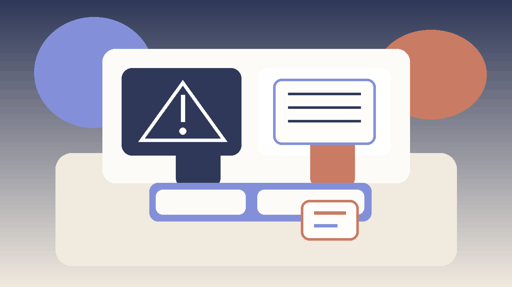

# Skill Game Common Mistakes

## 🪶 Introduction

Skill Game Common Mistakes matters because common mistakes shape how readers interpret pressure, timing, and trade-offs inside skill games. A page like this is most useful when it explains not only what to do, but why a choice becomes stronger or weaker as the situation changes.

This guide keeps the explanation practical. It shows how common mistakes connects to structured thinking, adaptation, pattern review, and deliberate practice, where beginners usually misread the situation, and how to turn the idea into a repeatable habit.

The article is also written for human readability, not just keyword coverage. Instead of relying on thin summaries, it explains the reasoning behind stronger choices, the trade-offs behind weaker ones, and the kinds of examples readers can recognize from their own sessions.

---

## 🖼️ Common Mistakes Overview

---

## 🎯 What Counts as a Common Mistake?

Common mistakes are the practice of handling one important layer of skill games in a more deliberate way. It becomes useful when players stop reacting only to the last move and start looking at context, options, and consequences. In practical terms, it helps readers judge when a line is solid, when it is thin, and when it only looks attractive on the surface.

A readable guide should make that judgment easier. It should show how the topic appears in ordinary positions, how it affects later decisions, and why small differences in context can change the best response.

---

# 🧠 1. Confusing Activity With Progress
One of the most common mistakes in skill games is assuming that a busy line is automatically a productive one. Players often push the pace because it feels assertive, even when a calmer move would protect more value.

A mistake connected to confusing activity with progress often repeats because it feels justified in the moment. Good educational writing should expose the hidden cost of that choice, so the reader can see why the habit survives and what makes it expensive over time.

To apply this, readers can watch for the earliest trigger behind confusing activity with progress and replace the old reaction with one calmer default response. Over time, that turns a repeated mistake into a recognizable warning sign rather than a surprise.

# 🧠 2. Ignoring Position Quality
Many avoidable losses begin with poor position reading. When readers focus only on their own plan and ignore what the table or board now allows, they walk into pressure that was visible one turn earlier.

A mistake connected to ignoring position quality often repeats because it feels justified in the moment. Good educational writing should expose the hidden cost of that choice, so the reader can see why the habit survives and what makes it expensive over time.

To apply this, readers can watch for the earliest trigger behind ignoring position quality and replace the old reaction with one calmer default response. Over time, that turns a repeated mistake into a recognizable warning sign rather than a surprise.

# 🧠 3. Misreading Information
Bad decisions often come from treating weak information as certainty. A small clue can be useful, but it becomes dangerous when it is treated like proof. a patient line that protects future options, a review habit that catches repeat errors, or an aggressive move that only works in one kind of table The better approach is to update gently instead of overcommitting.

A mistake connected to misreading information often repeats because it feels justified in the moment. Good educational writing should expose the hidden cost of that choice, so the reader can see why the habit survives and what makes it expensive over time.

To apply this, readers can watch for the earliest trigger behind misreading information and replace the old reaction with one calmer default response. Over time, that turns a repeated mistake into a recognizable warning sign rather than a surprise.

# 🧠 4. Taking the Wrong Kind of Risk
Not all risks are equal. Some risks are calculated and worth taking because the downside is manageable. Others are simply expensive guesses. Mistake-heavy play usually comes from failing to separate those two categories.

A mistake connected to taking the wrong kind of risk often repeats because it feels justified in the moment. Good educational writing should expose the hidden cost of that choice, so the reader can see why the habit survives and what makes it expensive over time.

To apply this, readers can watch for the earliest trigger behind taking the wrong kind of risk and replace the old reaction with one calmer default response. Over time, that turns a repeated mistake into a recognizable warning sign rather than a surprise.

# 🧠 5. Repeating a Familiar Line
Readers often keep using the line that worked once, even when the context is different. Familiarity feels safe, but repeated patterns become predictable and easier to punish.

A mistake connected to repeating a familiar line often repeats because it feels justified in the moment. Good educational writing should expose the hidden cost of that choice, so the reader can see why the habit survives and what makes it expensive over time.

To apply this, readers can watch for the earliest trigger behind repeating a familiar line and replace the old reaction with one calmer default response. Over time, that turns a repeated mistake into a recognizable warning sign rather than a surprise.

# 🧠 6. Forgetting the Long Game
Short-term thinking creates many beginner errors. A move can look fine in isolation and still weaken the next two turns. Stronger players look at whether the current line improves the position that comes after it.

A mistake connected to forgetting the long game often repeats because it feels justified in the moment. Good educational writing should expose the hidden cost of that choice, so the reader can see why the habit survives and what makes it expensive over time.

To apply this, readers can watch for the earliest trigger behind forgetting the long game and replace the old reaction with one calmer default response. Over time, that turns a repeated mistake into a recognizable warning sign rather than a surprise.

# 🧠 7. Reviewing Outcomes Instead of Decisions
A bad review habit is to judge only by the result. A player can win with a poor decision or lose after making the sound choice. Real improvement comes from examining the quality of the reasoning, not just the scoreboard.

A mistake connected to reviewing outcomes instead of decisions often repeats because it feels justified in the moment. Good educational writing should expose the hidden cost of that choice, so the reader can see why the habit survives and what makes it expensive over time.

To apply this, readers can watch for the earliest trigger behind reviewing outcomes instead of decisions and replace the old reaction with one calmer default response. Over time, that turns a repeated mistake into a recognizable warning sign rather than a surprise.

# 🧠 8. Turning Mistakes Into a Checklist
The value of a common-mistakes page is not to create fear. It is to build awareness. Readers improve faster when they use mistakes as prompts for better habits, not as labels that make them play timidly.

A mistake connected to turning mistakes into a checklist often repeats because it feels justified in the moment. Good educational writing should expose the hidden cost of that choice, so the reader can see why the habit survives and what makes it expensive over time.

To apply this, readers can watch for the earliest trigger behind turning mistakes into a checklist and replace the old reaction with one calmer default response. Over time, that turns a repeated mistake into a recognizable warning sign rather than a surprise.

---

## ⚠️ Common Mistakes

- Turning a mistakes guide into a fear list instead of a learning tool.
- Assuming every bad result came from one visible error.
- Treating a single success as proof that the same line is always correct.
- Reacting to pressure before checking whether the position actually changed.
- Reviewing the outcome without reviewing the quality of the reasoning.

---

## 🧾 Summary

The most practical way to improve common mistakes is to treat it as a repeatable habit rather than as a special trick. In skill games, readers gain more from calm observation and consistent routines than from dramatic one-off plays. The strongest takeaway is to connect every idea back to context, trade-offs, and what the next decision will look like.

That balance is what keeps the page search-friendly without making it feel artificial. The keyword belongs in the article because it matches the topic, but the real value comes from clear reasoning, realistic examples, and language that a reader can stay with from beginning to end.

---

## 🔥 SEO Keywords

skill gaming common mistakes
skill game strategy
competitive improvement
game decision making
strategic gaming

---

## Related Pages

- [Skill Gaming Fundamentals](./fundamentals.md)
- [Skill Game Decision Making](./decision-making.md)
- [Skill Game Risk Balance](./risk-balance.md)
- [Skill Game Scenarios](./scenarios.md)
