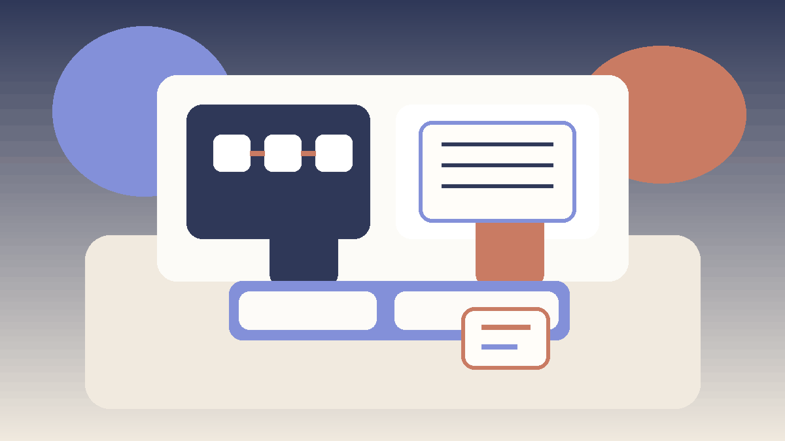

# Skill Game Decision Making

## 🪶 Introduction

Skill Game Decision Making matters because decision making shapes how readers interpret pressure, timing, and trade-offs inside skill games. A page like this is most useful when it explains not only what to do, but why a choice becomes stronger or weaker as the situation changes.

This guide keeps the explanation practical. It shows how decision making connects to structured thinking, adaptation, pattern review, and deliberate practice, where beginners usually misread the situation, and how to turn the idea into a repeatable habit.

The article is also written for human readability, not just keyword coverage. Instead of relying on thin summaries, it explains the reasoning behind stronger choices, the trade-offs behind weaker ones, and the kinds of examples readers can recognize from their own sessions.

---

## 🖼️ Decision Making Overview

---

## 🎯 What Is Good Decision Making?

Decision making is the practice of handling one important layer of skill games in a more deliberate way. It becomes useful when players stop reacting only to the last move and start looking at context, options, and consequences. In practical terms, it helps readers judge when a line is solid, when it is thin, and when it only looks attractive on the surface.

A readable guide should make that judgment easier. It should show how the topic appears in ordinary positions, how it affects later decisions, and why small differences in context can change the best response.

---

# 🧠 1. Define the Real Decision
Many errors begin because players solve the wrong problem. Before choosing a move, it helps to ask what the decision actually is: a safety question, a timing question, a pressure question, or a value question.

When the focus is define the real decision, the real advantage is usually not brilliance but structure. Better decision making come from asking stronger questions before acting, especially when the position is messy or the information is incomplete.

If readers want to apply this immediately, they can use define the real decision as a checkpoint: identify the real question, compare two realistic options, and ask which error would be easier to recover from. That small routine improves decision quality in skill games without making play feel mechanical.

# 🧠 2. Gather the Right Information
Decision making improves when the information step becomes deliberate. Look at the current position, the remaining threats, the pace of the table, and the likely response to each option before committing.

When the focus is gather the right information, the real advantage is usually not brilliance but structure. Better decision making come from asking stronger questions before acting, especially when the position is messy or the information is incomplete.

If readers want to apply this immediately, they can use gather the right information as a checkpoint: identify the real question, compare two realistic options, and ask which error would be easier to recover from. That small routine improves decision quality in skill games without making play feel mechanical.

# 🧠 3. Compare Options, Not Feelings
A useful decision process compares at least two realistic lines. This matters because intuition often makes the first appealing move feel inevitable. Real comparison reveals whether that move is truly strongest or simply easiest to notice.

When the focus is compare options, not feelings, the real advantage is usually not brilliance but structure. Better decision making come from asking stronger questions before acting, especially when the position is messy or the information is incomplete.

If readers want to apply this immediately, they can use compare options, not feelings as a checkpoint: identify the real question, compare two realistic options, and ask which error would be easier to recover from. That small routine improves decision quality in skill games without making play feel mechanical.

# 🧠 4. Estimate the Cost of Being Wrong
The best line is not always the one with the highest upside. Sometimes it is the line that keeps the damage small if the read is off. That is especially important in skill games, where uncertainty is part of normal play.

When the focus is estimate the cost of being wrong, the real advantage is usually not brilliance but structure. Better decision making come from asking stronger questions before acting, especially when the position is messy or the information is incomplete.

If readers want to apply this immediately, they can use estimate the cost of being wrong as a checkpoint: identify the real question, compare two realistic options, and ask which error would be easier to recover from. That small routine improves decision quality in skill games without making play feel mechanical.

# 🧠 5. Use Context to Break Ties
When two lines look close, context becomes the tie-breaker. Ask which option suits the current score, the current pressure level, and the kind of player or table dynamic in front of you.

When the focus is use context to break ties, the real advantage is usually not brilliance but structure. Better decision making come from asking stronger questions before acting, especially when the position is messy or the information is incomplete.

If readers want to apply this immediately, they can use use context to break ties as a checkpoint: identify the real question, compare two realistic options, and ask which error would be easier to recover from. That small routine improves decision quality in skill games without making play feel mechanical.

# 🧠 6. Commit Once the Choice Is Made
Half-made decisions create sloppy execution. Once the line is chosen, commit to it and play it clearly. Wavering usually means the reader skipped an earlier step and is still trying to decide after acting.

When the focus is commit once the choice is made, the real advantage is usually not brilliance but structure. Better decision making come from asking stronger questions before acting, especially when the position is messy or the information is incomplete.

If readers want to apply this immediately, they can use commit once the choice is made as a checkpoint: identify the real question, compare two realistic options, and ask which error would be easier to recover from. That small routine improves decision quality in skill games without making play feel mechanical.

# 🧠 7. Review the Process Afterward
A decision making page should encourage review, but with the right emphasis. The useful question is not 'Did it work?' but 'Was the reasoning sound based on what I knew at the time?'

When the focus is review the process afterward, the real advantage is usually not brilliance but structure. Better decision making come from asking stronger questions before acting, especially when the position is messy or the information is incomplete.

If readers want to apply this immediately, they can use review the process afterward as a checkpoint: identify the real question, compare two realistic options, and ask which error would be easier to recover from. That small routine improves decision quality in skill games without making play feel mechanical.

# 🧠 8. Turn Decisions Into Habits
Better decision making comes from building a stable process that works even when attention is split. Over time, the goal is to make clear thinking feel normal rather than exceptional.

When the focus is turn decisions into habits, the real advantage is usually not brilliance but structure. Better decision making come from asking stronger questions before acting, especially when the position is messy or the information is incomplete.

If readers want to apply this immediately, they can use turn decisions into habits as a checkpoint: identify the real question, compare two realistic options, and ask which error would be easier to recover from. That small routine improves decision quality in skill games without making play feel mechanical.

---

## ⚠️ Common Mistakes

- Choosing too quickly because the first reasonable option feels good enough.
- Ignoring the cost of being wrong when the read is uncertain.
- Treating a single success as proof that the same line is always correct.
- Reacting to pressure before checking whether the position actually changed.
- Reviewing the outcome without reviewing the quality of the reasoning.

---

## 🧾 Summary

The most practical way to improve decision making is to treat it as a repeatable habit rather than as a special trick. In skill games, readers gain more from calm observation and consistent routines than from dramatic one-off plays. The strongest takeaway is to connect every idea back to context, trade-offs, and what the next decision will look like.

That balance is what keeps the page search-friendly without making it feel artificial. The keyword belongs in the article because it matches the topic, but the real value comes from clear reasoning, realistic examples, and language that a reader can stay with from beginning to end.

---

## 🔥 SEO Keywords

skill gaming decision making
skill game strategy
competitive improvement
game decision making
strategic gaming

---

## Related Pages

- [Skill Gaming Fundamentals](./fundamentals.md)
- [Skill Game Game Awareness](./game-awareness.md)
- [Skill Game Risk Balance](./risk-balance.md)
- [Skill Game Strategic Thinking](./strategic-thinking.md)
