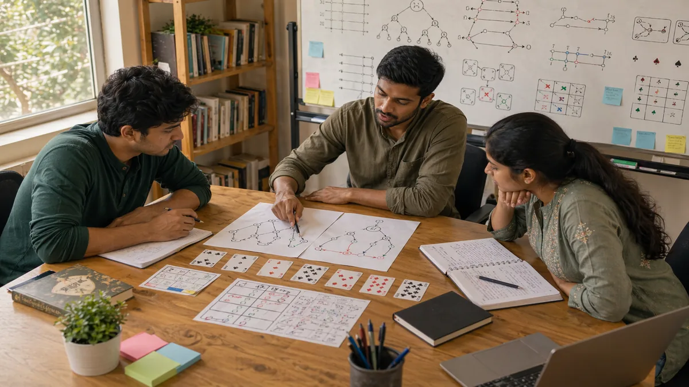

# Skill Game Decision Making: How to Choose Better Lines Under Pressure

## Introduction

Skill game decision making is where theory turns into actual results. Players usually do not struggle because they know nothing. They struggle because the position gets noisy, several options look reasonable, and the wrong detail gets treated as the most important one.

This page breaks decision making into a practical process. It focuses on how to define the real problem, compare realistic options, estimate downside, and review whether the thought process was sound. The aim is not to make every choice slow. It is to make your important choices more disciplined.

When players review bad sessions honestly, many of the biggest losses come from familiar patterns: solving the wrong problem, forcing certainty too early, and picking the line that looks strongest before asking what happens if the read is wrong.

---

## Decision Making Overview

---

## What Is Skill Game Decision Making?

Skill game decision making is the process of choosing actions based on context, risk, future consequences, and information quality rather than impulse alone. Good decision making does not require perfect reads. It requires a better structure for handling uncertainty.

In practical terms, this means noticing when a spot is about safety instead of pressure, when a lower-variance line is worth more than a thin upside line, and when the situation needs patience rather than force.

---

# 1. Define the Real Question First

Many poor decisions start before the comparison even begins. The player asks the wrong question. They think the position is about winning the current exchange when it is really about preserving control for what comes next.

A useful habit is to label the spot before you act. Is this mainly a protection spot, a pressure spot, a timing spot, or a recovery spot? Once the real question is clear, weak options often remove themselves.

# 2. Check the Quality of Your Information

Not all information deserves the same weight. Some details are stable and meaningful. Others are thin clues that should only make you lean slightly, not commit heavily.

This matters because players often overplay weak information. A hesitation, one recent pattern, or one surprising line can matter, but only in proportion to the rest of the position. Good decisions come from balanced evidence, not dramatic interpretation.

# 3. Compare Two Realistic Options

If you only evaluate the first move you notice, you are not really deciding. You are reacting. A stronger process compares at least two realistic lines and asks what each one achieves, what each one risks, and what each one leaves behind for the next stage.

This habit is valuable because many mistakes survive only when they are never compared with a calmer alternative. The second option is often less exciting, but more practical.

# 4. Estimate the Cost of Being Wrong

One of the clearest markers of mature decision making is downside awareness. A high-upside line is not automatically strong if a small read error turns it into a large loss.

This does not mean avoiding bold choices. It means understanding the price of error. In many real sessions, the best line is the one that performs well enough when right and does not collapse when wrong.

# 5. Use the Session Context to Break Close Spots

Some choices remain close even after careful comparison. That is where context matters. The score, resource pressure, emotional rhythm of the table, and opponent tendencies can all change which line makes more sense.

Context is especially useful in tie-break situations. It often tells you whether this is the moment to simplify, press, wait, or keep the game shape flexible.

# 6. Commit Cleanly After Choosing

Half-committed decisions create messy execution. Once the choice is made, it should be carried out clearly. If you keep re-deciding during the action, that usually means the process was incomplete before the move began.

This is why a short pre-action routine matters. The more complete the thinking is beforehand, the cleaner the execution becomes afterward.

# 7. Review the Reasoning, Not Just the Result

A player can make a good decision and still lose the spot. A player can make a poor decision and still escape. If review is based only on outcome, learning becomes distorted very quickly.

After a session, ask whether the read was reasonable, whether the alternatives were compared honestly, and whether the cost of error was understood well enough. That kind of review improves future decisions much more than scoreboard reactions.

# 8. Turn Better Decisions Into Habits

The final goal is not to think longer forever. It is to think better until the process becomes natural. Over time, you want the structure to feel normal: define the real question, check information, compare lines, respect downside, then act.

That is how decision making stops being a special effort and becomes part of your default play.

---

## Real Session Example

A player reaches a tense point in the session and sees an aggressive line that seems to seize momentum. In the review, the move still looks tempting, but a slower replay shows the real issue. The position was actually a recovery spot, not a pressure spot. The player solved the wrong problem and chose a line with poor downside if the read was off by even a little.

The correction is not "never attack." The correction is to classify the spot correctly before choosing the style of response.

---

## Why Skill Game Decision Making Matters

Decision making matters because it sits at the center of actual improvement. Many players consume plenty of strategy content, but they still lose value in ordinary spots because their thinking process breaks down under time pressure or emotional pressure.

For search readers, this is often the page that answers the practical question behind many queries: how do I make better choices when the position is not obvious?

---

## How To Improve Decision Making

Use this post-session checklist:

1. What did I think the spot was about?
2. What were the two real options?
3. What detail did I overweight?
4. What was the downside if my read was wrong?
5. What simpler decision rule would have improved the choice?

Answering these questions on a few real spots each week is usually more effective than reading several strategy pages without review.

---

## Common Mistakes

- Solving the wrong problem.
- Treating weak information like proof.
- Comparing one move against fantasy instead of against a real alternative.
- Ignoring downside because the upside looks attractive.
- Judging the decision only by the result.

---

## FAQ

### What is the biggest decision-making leak for most players?

Often it is misclassifying the spot. They think they should push when they really need to stabilize, or they simplify when pressure is actually more valuable.

### Should I always choose the safer line?

No. The safer line is not always the best line. The goal is to choose the line whose reward, downside, and context make the most sense together.

### How can I make better decisions without slowing down too much?

Use a short, repeatable process. The point is not to overthink every move. It is to think clearly in the spots that matter most.

### Why do I make good decisions in review but not live?

Because review is calm and live play is noisy. You need a shorter process that survives pressure, not just a long explanation that works after the fact.

### Which page pairs best with this one?

[Skill Game Risk Balance](./risk-balance.md) pairs well because downside control and decision quality are tightly connected.

---

## Summary

Skill game decision making improves when you define the real problem, weigh information honestly, compare real alternatives, and respect the cost of error. That process makes your choices more stable under pressure and gives your reviews something concrete to work with afterward.

---

## SEO Keywords

skill game decision making
how to make better decisions in games
skill game strategy decisions
decision making under pressure
improve game decisions

---

## Related Pages

- [Skill Gaming Fundamentals](./fundamentals.md)
- [Skill Game Risk Balance](./risk-balance.md)
- [Skill Game Strategic Thinking](./strategic-thinking.md)
- [Skill Game Common Mistakes](./common-mistakes.md)
