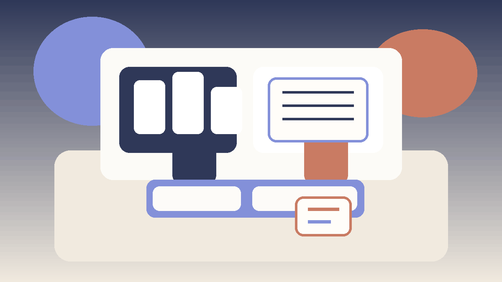

# Skill Game Scenarios

## 🪶 Introduction

Skill Game Scenarios matters because scenarios shape how readers interpret pressure, timing, and trade-offs inside skill games. A page like this is most useful when it explains not only what to do, but why a choice becomes stronger or weaker as the situation changes.

This guide keeps the explanation practical. It shows how scenarios connects to structured thinking, adaptation, pattern review, and deliberate practice, where beginners usually misread the situation, and how to turn the idea into a repeatable habit.

The article is also written for human readability, not just keyword coverage. Instead of relying on thin summaries, it explains the reasoning behind stronger choices, the trade-offs behind weaker ones, and the kinds of examples readers can recognize from their own sessions.

---

## 🖼️ Scenarios Overview

---

## 🎯 What Makes Scenarios Useful?

Scenarios are the practice of handling one important layer of skill games in a more deliberate way. It becomes useful when players stop reacting only to the last move and start looking at context, options, and consequences. In practical terms, it helps readers judge when a line is solid, when it is thin, and when it only looks attractive on the surface.

A readable guide should make that judgment easier. It should show how the topic appears in ordinary positions, how it affects later decisions, and why small differences in context can change the best response.

---

# 🧠 1. Why Scenario Study Works
Scenario study helps because it turns abstract advice into usable mental pictures. When readers recognize a familiar structure, they make calmer choices and waste less time searching for a starting point.

A section built around why scenario study works makes the article easier to absorb because it turns abstract strategy into a recognizable moment. Readers can picture the scene, compare it to their own experience, and understand why one response travels better than another.

Readers often learn fastest when why scenario study works is grouped with similar situations instead of treated as a one-off example. If two positions share the same danger and the same practical priority, they usually deserve a similar starting approach even if the details differ.

# 🧠 2. Use Scenarios to Build Priorities
The best scenario guides do not try to script every move. Instead, they clarify priorities: what must be protected first, what can be delayed, and which clue matters most in this type of position.

A section built around use scenarios to build priorities makes the article easier to absorb because it turns abstract strategy into a recognizable moment. Readers can picture the scene, compare it to their own experience, and understand why one response travels better than another.

Readers often learn fastest when use scenarios to build priorities is grouped with similar situations instead of treated as a one-off example. If two positions share the same danger and the same practical priority, they usually deserve a similar starting approach even if the details differ.

# 🧠 3. Compare Similar Situations
A scenario becomes more useful when it is compared with a near-miss version of the same spot. That comparison teaches readers which details truly change the right response and which details are secondary.

A section built around compare similar situations makes the article easier to absorb because it turns abstract strategy into a recognizable moment. Readers can picture the scene, compare it to their own experience, and understand why one response travels better than another.

Readers often learn fastest when compare similar situations is grouped with similar situations instead of treated as a one-off example. If two positions share the same danger and the same practical priority, they usually deserve a similar starting approach even if the details differ.

# 🧠 4. Notice the Turning Point
In most scenarios, one turning point matters more than the rest. It may be a moment of overcommitment, a missed safe line, or a quiet cue that the position is changing. Finding that point is the key lesson.

A section built around notice the turning point makes the article easier to absorb because it turns abstract strategy into a recognizable moment. Readers can picture the scene, compare it to their own experience, and understand why one response travels better than another.

Readers often learn fastest when notice the turning point is grouped with similar situations instead of treated as a one-off example. If two positions share the same danger and the same practical priority, they usually deserve a similar starting approach even if the details differ.

# 🧠 5. Practice the First Two Questions
Readers improve faster when they practice the first two questions for every scenario: what is the real danger here, and what is the most practical source of value? Those questions prevent scattered thinking.

A section built around practice the first two questions makes the article easier to absorb because it turns abstract strategy into a recognizable moment. Readers can picture the scene, compare it to their own experience, and understand why one response travels better than another.

Readers often learn fastest when practice the first two questions is grouped with similar situations instead of treated as a one-off example. If two positions share the same danger and the same practical priority, they usually deserve a similar starting approach even if the details differ.

# 🧠 6. Use Scenarios to Prepare Emotionally
Scenario study is also useful because it prepares readers emotionally. Familiar positions feel less chaotic, which means there is more mental space for observation and cleaner execution.

A section built around use scenarios to prepare emotionally makes the article easier to absorb because it turns abstract strategy into a recognizable moment. Readers can picture the scene, compare it to their own experience, and understand why one response travels better than another.

Readers often learn fastest when use scenarios to prepare emotionally is grouped with similar situations instead of treated as a one-off example. If two positions share the same danger and the same practical priority, they usually deserve a similar starting approach even if the details differ.

# 🧠 7. Keep the Lesson Transferable
A good scenario page should leave the reader with a transferable lesson, not just a memory of one example. The value is in the pattern behind the scene, not in the exact pieces or cards used that day.

A section built around keep the lesson transferable makes the article easier to absorb because it turns abstract strategy into a recognizable moment. Readers can picture the scene, compare it to their own experience, and understand why one response travels better than another.

Readers often learn fastest when keep the lesson transferable is grouped with similar situations instead of treated as a one-off example. If two positions share the same danger and the same practical priority, they usually deserve a similar starting approach even if the details differ.

# 🧠 8. Review Scenarios From Real Play
Readers can strengthen scenario knowledge by saving a few memorable moments from real sessions and asking what category each one belongs to. That turns experience into a growing library of usable references.

A section built around review scenarios from real play makes the article easier to absorb because it turns abstract strategy into a recognizable moment. Readers can picture the scene, compare it to their own experience, and understand why one response travels better than another.

Readers often learn fastest when review scenarios from real play is grouped with similar situations instead of treated as a one-off example. If two positions share the same danger and the same practical priority, they usually deserve a similar starting approach even if the details differ.

---

## ⚠️ Common Mistakes

- Memorizing examples without extracting the transferable lesson.
- Copying a response from one scenario into a different structure.
- Treating a single success as proof that the same line is always correct.
- Reacting to pressure before checking whether the position actually changed.
- Reviewing the outcome without reviewing the quality of the reasoning.

---

## 🧾 Summary

The most practical way to improve scenarios is to treat it as a repeatable habit rather than as a special trick. In skill games, readers gain more from calm observation and consistent routines than from dramatic one-off plays. The strongest takeaway is to connect every idea back to context, trade-offs, and what the next decision will look like.

That balance is what keeps the page search-friendly without making it feel artificial. The keyword belongs in the article because it matches the topic, but the real value comes from clear reasoning, realistic examples, and language that a reader can stay with from beginning to end.

---

## 🔥 SEO Keywords

skill gaming scenarios
skill game strategy
competitive improvement
game decision making
strategic gaming

---

## Related Pages

- [Skill Game Decision Making](./decision-making.md)
- [Skill Game Game Awareness](./game-awareness.md)
- [Skill Game Risk Balance](./risk-balance.md)
- [Skill Game Advanced Concepts](./advanced-concepts.md)
