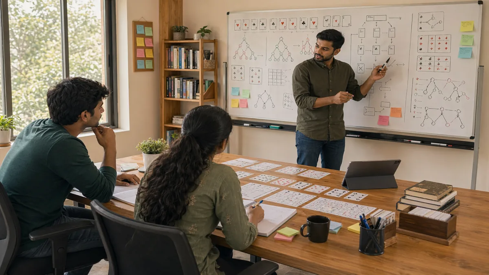

# Skill Game Scenarios: How to Learn From Real Positions Instead of Abstract Advice

## Introduction

Skill game scenarios are where strategy becomes believable. A concept can sound sensible in theory and still feel slippery until it is attached to a real position with real pressure, incomplete information, and several imperfect options.

This page explains how to study scenarios in a way that actually improves play. It focuses on identifying the key decision, understanding what made the spot difficult, and extracting a lesson that can transfer to future sessions without pretending that every position is identical.

Players often improve faster from one well-reviewed scenario than from several pages of generic advice, because the memory of a real spot is much easier to revisit.

---

## Scenarios Overview

---

## What Are Skill Game Scenarios?

Skill game scenarios are realistic positions or sequences used to study decision making, awareness, timing, and trade-offs. A good scenario is specific enough to feel real but broad enough to teach something reusable.

Scenario study matters because it forces players to explain what was important in that exact moment rather than hiding behind general strategy language.

---

# 1. Pick Scenarios That Actually Mattered

Not every spot deserves full review. The most useful scenarios are the ones where the session shape changed, a major decision was unclear, or a repeated leak appeared again.

This matters because good review time is limited. Studying low-value spots can create the illusion of work without much improvement.

# 2. Define the Key Question in the Spot

Every good scenario has one central question. Was the spot about survival, pressure, timing, value protection, or transition to the next phase? If that question stays blurry, the lesson usually stays blurry too.

This is why scenario notes should begin with the real decision, not with a long retelling of everything that happened.

# 3. Reconstruct the Information Available at the Time

One of the biggest review mistakes is using knowledge from later in the sequence to judge the earlier decision. That makes the lesson less honest and less useful.

A better review asks what you actually knew in the moment. This keeps the scenario grounded in real decision conditions.

# 4. Compare the Best Two Lines

A scenario becomes educational when you compare realistic alternatives. Why did one line feel attractive? What did the calmer line preserve? Which downside mattered more? These comparisons turn memory into strategy.

Without alternatives, scenario notes become storytelling rather than analysis.

# 5. Identify the Misread Clearly

The most valuable part of a scenario is often the misread. Maybe you treated weak evidence as certainty. Maybe you ignored a position shift. Maybe you chose urgency over structure.

If the misread is named clearly, the lesson transfers much more easily to future sessions.

# 6. Extract a Reusable Rule

Every strong scenario should end with one practical rule. Not a grand philosophy, just one sentence you can actually carry into the next session. For example: "When recovery is fragile, prefer the line that keeps two exits open."

This makes scenario work easier to remember and easier to use live.

# 7. Revisit Similar Scenarios Together

Single examples can teach a lot, but groups of similar scenarios teach even more. When several review spots fail for the same reason, the leak becomes obvious.

That is why scenario folders or tags are useful. They help you notice patterns across different sessions instead of treating every bad moment as isolated.

# 8. Use Scenarios to Build Judgment, Not Scripts

The goal of scenario study is not to memorize exact moves. It is to improve judgment. A later position may look similar but differ in one crucial factor, and a rigid script can fail badly there.

Scenario work is strongest when it sharpens your reading, not when it replaces it.

---

## Real Session Example

A player reviews a difficult spot and first writes, "I should have been more aggressive." After slowing the sequence down, the better lesson appears. The real issue was that the player never reconstructed the actual information available in the moment. The aggressive line only looked right because the later reveal was already known in hindsight.

That is a far better scenario lesson than the original conclusion. It trains honesty and improves future judgment.

---

## Why Scenarios Matter

Scenarios matter because they bridge the gap between concept and memory. They also serve a strong SEO purpose because many readers search with language tied to situations, examples, and "what should I do in this spot?" questions.

A strong scenario page should help readers build review notes they can actually reuse.

---

## How To Review Scenarios Better

Use this structure:

1. What was the key question?
2. What did I know at the time?
3. What were the two best lines?
4. What did I misread?
5. What one rule do I want to remember next time?

This keeps scenario review focused and practical.

---

## Common Mistakes

- Reviewing low-value spots instead of key turning points.
- Letting hindsight rewrite the original decision.
- Describing what happened without naming the real misread.
- Extracting vague lessons that do not transfer.
- Treating scenario study like memorization.

---

## FAQ

### What makes a scenario worth reviewing?

Usually a scenario is worth reviewing if it changed the direction of the session or exposed a repeated leak in your decision process.

### Should I review winning scenarios too?

Yes. Some winning spots contain poor reasoning that was hidden by a good result.

### How detailed should scenario notes be?

Detailed enough to reconstruct the decision clearly, but short enough that you will actually revisit them.

### Can scenario study replace fundamentals?

No. Scenarios are strongest when fundamentals already give you a language for understanding what went wrong.

### Which page pairs best with this one?

[Skill Game Decision Making](./decision-making.md) is the clearest companion because scenarios usually revolve around one important choice.

---

## Summary

Skill game scenarios help players learn from real positions instead of vague theory. When you define the key question, rebuild the information honestly, compare real lines, and extract one reusable lesson, scenario study becomes one of the most efficient forms of improvement.

---

## SEO Keywords

skill game scenarios
game strategy examples
how to review game situations
real scenario game analysis
learn from game positions

---

## Related Pages

- [Skill Game Decision Making](./decision-making.md)
- [Skill Game Common Mistakes](./common-mistakes.md)
- [Skill Game Game Awareness](./game-awareness.md)
- [Skill Game Strategic Thinking](./strategic-thinking.md)
