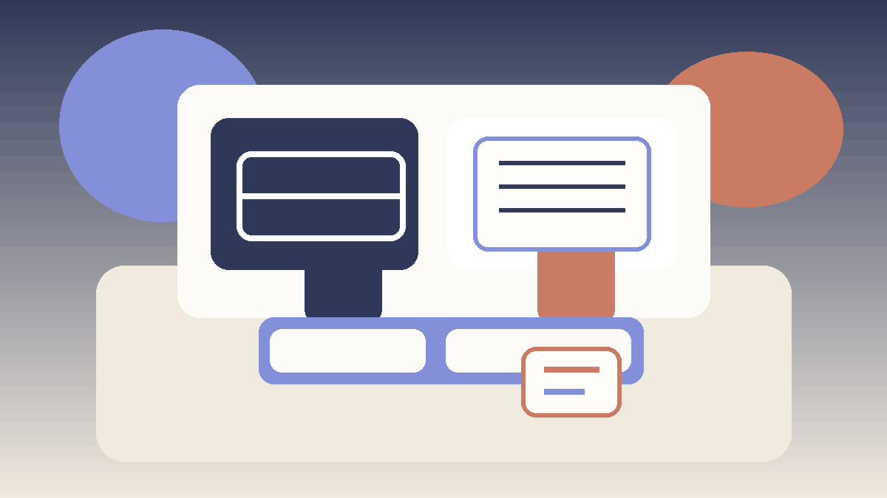

# Skill Game Strategy India

## 🪶 Introduction

Skill Game Strategy India is designed for players who want strategy that feels practical, repeatable, and honest about trade-offs. It brings the core topics into one clear structure so readers can move from foundations to deeper strategy without losing sight of practical play.

Skill games become easier to improve when players stop searching for perfect moves and start building strong decision habits. This overview explains how the site is organized, what each section is trying to teach, and how to study the material in a steady, realistic order.

The aim is not just to cover keywords related to skill game strategy. It is to make the site easier to read, easier to navigate, and more useful for people who want practical explanations instead of thin summaries.

---

## 🖼️ Site Overview

---

## 🎯 What Is Skill Game Strategy India?

Skill Game Strategy India is a repository-based educational guide focused on skill games. It organizes practical strategy topics into a structure that is beginner-friendly, consistent, and still useful for readers who already have some experience. The goal is not to overwhelm the reader with theory, but to help them build a clearer process for learning and reviewing play.

---

# 🧠 1. Begin With the Basics
Readers get the most value when they begin with the fundamentals page and only move forward once the underlying structure feels clear. Topics like structured thinking, adaptation, pattern review, and deliberate practice are easier to use when the basics no longer require active effort.

In reader terms, this section matters because it helps turn the site from a collection of pages into a usable learning path for skill games. That improves both scan-ability and long-form readability, which is exactly what a strong educational content hub should do.

# 🧠 2. Use the Guide as a Learning Path
The content works best as a sequence. Fundamentals explain the base layer, common mistakes show where that base usually breaks, and decision making teaches how to act under pressure. Later pages add awareness, planning, and higher-level judgment.

In reader terms, this section matters because it helps turn the site from a collection of pages into a usable learning path for skill games. That improves both scan-ability and long-form readability, which is exactly what a strong educational content hub should do.

# 🧠 3. Study One Topic at a Time
A serious strategy site should not feel like a checklist to memorize in one sitting. It should feel like a reference you revisit with better questions after each session. That is why each page focuses on one layer of play at a time.

In reader terms, this section matters because it helps turn the site from a collection of pages into a usable learning path for skill games. That improves both scan-ability and long-form readability, which is exactly what a strong educational content hub should do.

# 🧠 4. Connect Reading to Real Sessions
The fastest improvement comes from pairing reading with live examples. After studying a page, it helps to find one moment from recent play that matches the topic and ask whether the explanation would have changed the choice.

In reader terms, this section matters because it helps turn the site from a collection of pages into a usable learning path for skill games. That improves both scan-ability and long-form readability, which is exactly what a strong educational content hub should do.

# 🧠 5. Review the Common Failure Points
Many players improve simply by removing repeated errors before trying to add advanced techniques. The common-mistakes page is there for exactly that reason: it turns vague frustration into specific, correctable habits.

In reader terms, this section matters because it helps turn the site from a collection of pages into a usable learning path for skill games. That improves both scan-ability and long-form readability, which is exactly what a strong educational content hub should do.

# 🧠 6. Build Observation Before Complexity
Topics like game awareness and pattern recognition should feel practical, not mystical. This site keeps them grounded in observation, timing, and repeatable review so readers can apply them without pretending to know more than they do.

In reader terms, this section matters because it helps turn the site from a collection of pages into a usable learning path for skill games. That improves both scan-ability and long-form readability, which is exactly what a strong educational content hub should do.

# 🧠 7. Use Strategy as a Process
The later pages are meant to deepen the reader's process, not replace it. Strategic thinking, risk balance, and advanced concepts become useful when they refine a stable routine for reading, planning, and adjusting.

In reader terms, this section matters because it helps turn the site from a collection of pages into a usable learning path for skill games. That improves both scan-ability and long-form readability, which is exactly what a strong educational content hub should do.

# 🧠 8. Return to the Guide Often
A good educational repository becomes more useful as the reader gains experience. The same article should feel different after ten more sessions because the reader now brings sharper questions and richer examples back to the page.

In reader terms, this section matters because it helps turn the site from a collection of pages into a usable learning path for skill games. That improves both scan-ability and long-form readability, which is exactly what a strong educational content hub should do.

---

## ⚠️ Common Mistakes

- Jumping straight to advanced pages before the fundamentals are stable.
- Reading several topics quickly without connecting them to real examples.
- Treating the guide as static advice instead of something to revisit after play.
- Looking only for tricks and skipping the reasoning behind the recommendations.
- Ignoring related pages that clarify trade-offs between connected ideas.

---

## 🧾 Summary

Skill Game Strategy India works best when readers use it as a steady learning path instead of a quick list of tips. Start with the basics, link each topic to real examples, and return to the guide as your understanding becomes more precise.

---

## 🔥 SEO Keywords

skill game strategy
skill gaming guide
strategic thinking
game awareness
competitive improvement

---

## Related Pages

- [Skill Gaming Fundamentals](./content/fundamentals.md)
- [Skill Game Decision Making](./content/decision-making.md)
- [Skill Game Game Awareness](./content/game-awareness.md)
- [Skill Game Advanced Concepts](./content/advanced-concepts.md)
